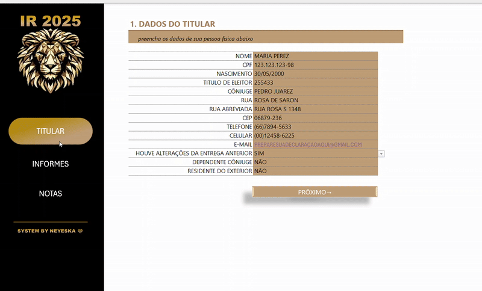
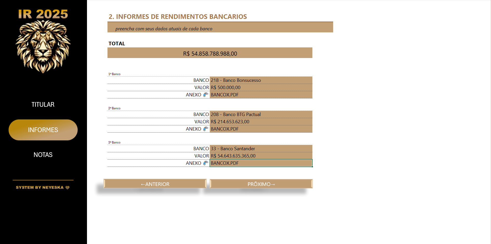
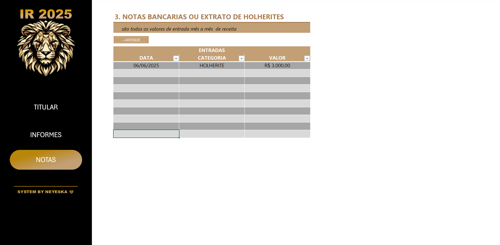

# App para Preenchimento de Declaração de Imposto de Renda

Desafio de Projeto criando uma ferramenta de apoio para Declaração de Imposto de Renda.

Este é um projeto que desenvolvi como parte de um desafio da Digital Innovation One (DIO). O objetivo era criar uma interface visualmente simples e funcional para preenchimento da declaração.

  

## 💻 Tecnologias utilizadas no projeto

- Excel
- Google

## ✨ Como foi feito ?

- Primeiramente realizamos a arte inicial de nossa ferramenta 
- Logo Criamos as interfaces siguientes respeitando a padronização de dados
- Verificamos as conexões entre as diferentes interfases, assim como verificamos a perfeita interação entre elas.

## 📚 Materiais

- Utilizaçao de Recursos fornecidos nos materiais complementares em relação aos codigos dos Bancos.

## 🛠️ Funcionalidades
- Visualização simples e objetiva para o usuario.
- Interatividade com as diferentes partes da planilha.
- Dashboard Organizado e funcional.

⌨️ com ❤️ por [Abner Neyeska](https://github.com/abner520/Abner-Neyeska)